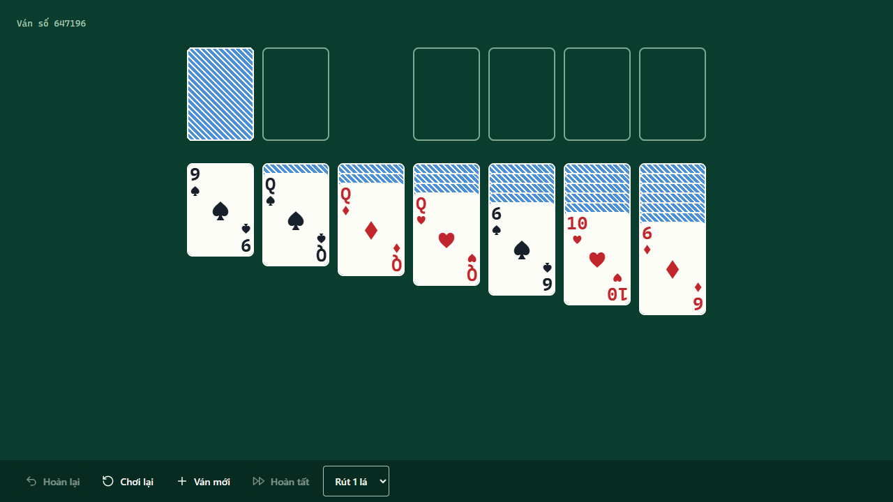

# 🃏 Klondike Solitaire — every deal comes from a seed, so you can play the same one twice

[](https://github.com/LeVanAnhDuc/web-game-solitaire/actions/workflows/ci.yml)
[](https://github.com/LeVanAnhDuc/web-game-solitaire/actions/workflows/deploy.yml)
[](https://github.com/LeVanAnhDuc/web-game-solitaire/releases)

Klondike Solitaire in the browser. No account, no ads, no server — the whole game is a
static page that runs on the player's machine.

**Play**: https://levananhduc.github.io/web-game-solitaire/



## Features

- Klondike Solitaire with a draw-1 / draw-3 toggle.
- Play by tapping or by dragging — both are first-class, on touch and with a mouse.
- Play the whole game from the keyboard, with visible focus and labelled cards.
- One tap sends a card up to its foundation; two taps look further, at the columns too.
- The board animates: cards fly between piles, face-down cards turn over, and a new
  game deals out from the deck.
- Finish the boring part in one press once every card is face up.
- Unlimited undo, back to the first move of the deal.
- Deals are generated from a seed, so restarting replays the exact same game, and
  `?van=<number>` reopens one you liked.

## Controls

Three ways in, and none of them is the poor relation.

| Action | Mouse / touch | Keyboard |
| ------ | ------------- | -------- |
| Move between piles | — | `←` `→` across, `↑` `↓` swap rows |
| Pick a card up, or put it down | Tap the card, then the target | `Space` |
| Send a card to its foundation | One tap on the card | — |
| Send a card anywhere it legally fits | Two taps | `Enter` |
| Drag a card or a run | Press and drag onto the target | — |
| Deal from the stock | Tap the stock | `Space` on the stock |
| Change how deep into a run you grab | Grab the card you want to start at | `↑` `↓` while holding a run |
| Cancel a selection | Tap the card again | `Esc` |

One tap looks only at the foundations, two taps look at the columns as well. That is
the split that keeps the common move — a card going up — from ever costing you a
choice of target.

## Getting started

```bash
yarn install
yarn dev            # http://localhost:3000
```

There is nothing to configure — the game reads no required environment variables. See
[`.env.example`](.env.example) for the one optional variable the deploy workflow sets.

## Commands

| Command | Does |
| --- | --- |
| `yarn dev` | Dev server |
| `yarn build` | Static export into `out/` |
| `yarn typecheck` | `tsc --noEmit` |
| `yarn lint` | ESLint, including the guard that keeps `src/game/` framework-free |
| `yarn test` | Vitest — rules and components |
| `yarn test:e2e` | Playwright against the built static export, at four viewports |
| `yarn check:bundle` | First-load JS budget, measured from the exported HTML (NFR-PERF-05) |
| `yarn check:audit` | Lists open Dependabot alerts, failing on high or above. Local only — `GITHUB_TOKEN` cannot read alerts, so CI gates on the dependency diff instead |
| `yarn release:next` | Which tag the next release would get, and why |
| `yarn release:notes v1.1.0` | What that release's notes would say |
| `yarn format` | Prettier |

`yarn test:e2e` and `yarn check:bundle` need `yarn build` to have run first: both look at
the exported site, because that is what GitHub Pages serves.

## How it is put together

Three layers, arrows only pointing down:

```
src/app + src/components   React, DOM, Tailwind, pointer and keyboard events
src/hooks/useGame          useReducer · Move[] history · undo
src/game                   plain TypeScript — the Klondike rules. No React.
```

`src/game/` never imports React or touches the browser, so the rules are tested
without rendering anything. A game is stored as a seed plus the list of moves played;
the current position is that list replayed from the deal, which is what makes undo,
restart and deterministic tests the same mechanism. `src/game/moves.ts` is the only
place a position changes.

## Continuous integration

| Workflow | Runs on | Does |
| --- | --- | --- |
| [`ci.yml`](.github/workflows/ci.yml) | every pull request and push to `main` | Two parallel jobs: lint + typecheck + unit tests, and build + first-load-JS budget + the end-to-end suite at four viewports. Pull requests get a third that fails on a newly introduced dependency with a high-or-above advisory (NFR-SEC-05) |
| [`deploy.yml`](.github/workflows/deploy.yml) | push to `main` | Rebuilds with `GITHUB_PAGES=true` and publishes `out/` to GitHub Pages. It re-runs the tests rather than trusting a green run it cannot see |
| [`release.yml`](.github/workflows/release.yml) | push to `main` | Gates on the tests, works out the next version, composes the notes, and publishes a GitHub release |

The end-to-end suite runs against `out/` through `scripts/serve.mjs` rather than a dev
server, because a static export is what gets deployed and a dev server is not it.

## Releases and versioning

Version numbers and release notes are **derived from the commit history**, so neither
depends on anyone remembering to do something. Both live in scripts you can run
locally — a release process you can only exercise by pushing to `main` is one nobody
exercises:

```bash
yarn release:next            # which tag the next release would get, and why
yarn release:notes v1.1.0    # what its notes would say
```

**How the version is decided**, against the previous `v*` tag:

| Since the last tag | Bump |
| --- | --- |
| a commit marked `feat!:` / `fix!:` …, or a `BREAKING CHANGE:` body | major |
| any `feat:` commit | minor |
| anything else | patch |

A commit **subject** can override it: `[release major]`, `[release minor]`, or
`[skip release]` to publish nothing. The markers are read from the subjects of the
commits being landed — when a pull request is merged, GitHub writes its own subject
("Merge pull request #2 from …"), so the merge commit is looked through to the commits
it brought in. The newest marker wins.

Only subjects count. A body that merely mentions a marker — this README, for one —
must never publish a version.

**How the notes are composed:** commit subjects since the previous tag, grouped by
their Conventional Commit prefix — breaking changes first, then What's new (`feat`),
Fixes (`fix`), Performance, Internals, Tests, Documentation, Build and tooling. Scopes
are kept as labels, so `feat(game): …` reads as **game**: …

Commits that are not Conventional Commits land under "Other" rather than being
dropped. A release note that swallows commits is a release note that has started
lying.

## Documentation

Everything else lives in [`docs/`](docs/README.md) — what the game is and is not
([`overview.md`](docs/01-product/overview.md)), what breaks silently
([`invariants.md`](docs/03-design/invariants.md)), and why each technical choice was
made ([`decisions/`](docs/decisions/README.md)).
